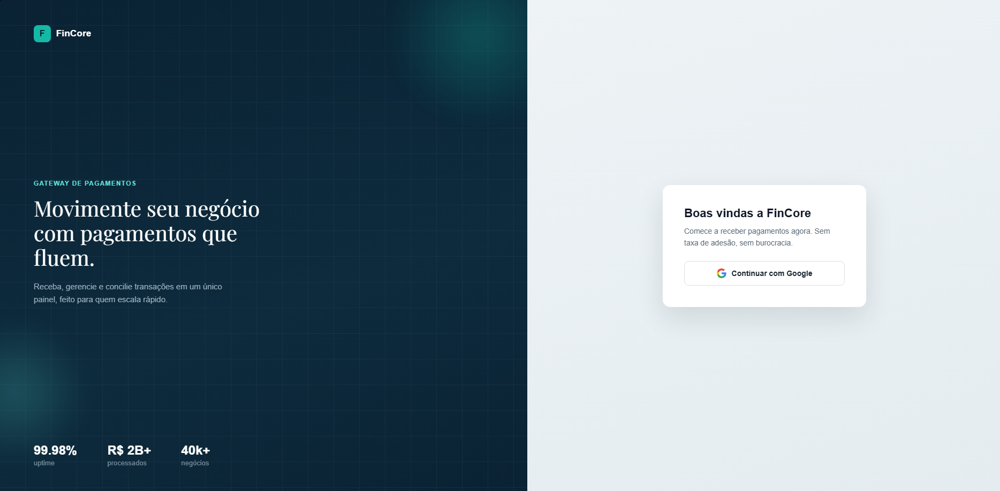
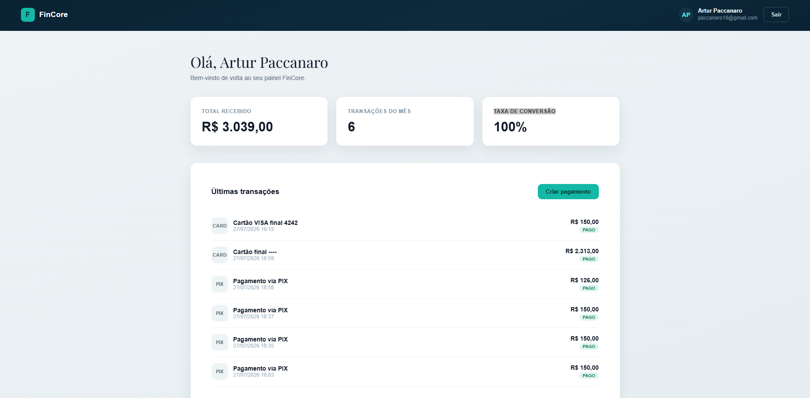
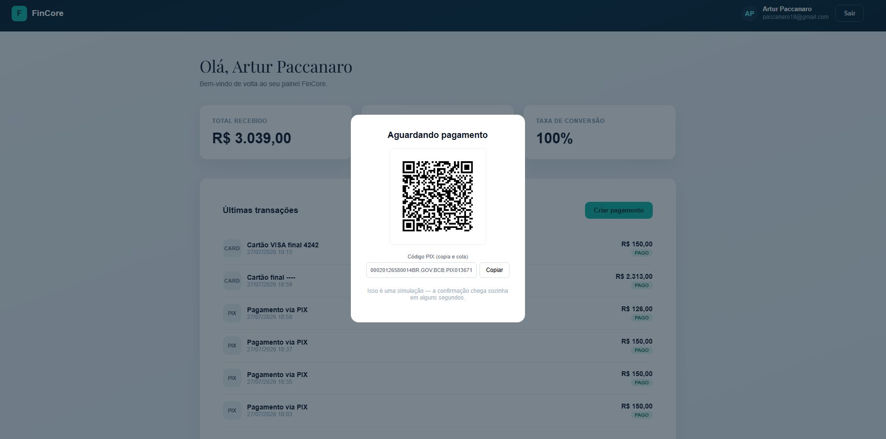
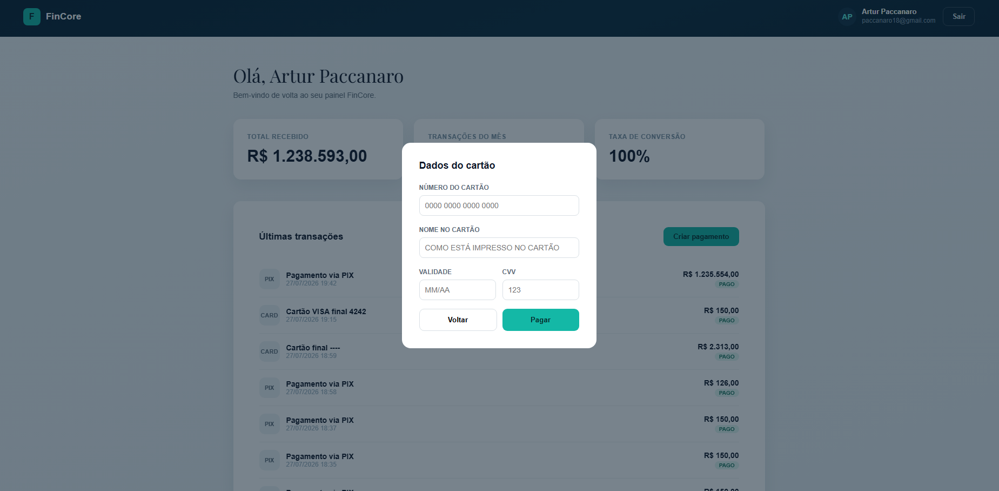

# FinCore — Gateway de Pagamentos Simulado

Gateway de pagamentos simulado, inspirado em serviços como Stripe e PagSeguro, construído para estudo e portfólio. O projeto cobre autenticação sem senha via Google (OAuth2/OIDC), criação de pagamentos PIX e cartão com QR code real, e confirmação assíncrona simulando o comportamento de um webhook de processadora real.
---

## Índice

- [Funcionalidades](#funcionalidades)
- [Arquitetura](#arquitetura)
- [Screenshots](#screenshots)
- [Stack tecnológica](#stack-tecnológica)
- [Como rodar o projeto](#como-rodar-o-projeto)
- [Endpoints da API](#endpoints-da-api)
- [Decisões de segurança](#decisões-de-segurança)
- [Estrutura do projeto](#estrutura-do-projeto)
- [Aprendizados e desafios técnicos](#aprendizados-e-desafios-técnicos)
- [Roadmap](#roadmap)

---

## Funcionalidades

- **Login sem senha com Google (OAuth2 / OpenID Connect)** — autenticação via conta Google, sem armazenar nem manipular senha do usuário.
- **Persistência automática de usuário** — padrão *find-or-create*: primeiro login cria o registro, logins seguintes apenas atualizam os dados.
- **Criação de pagamentos via PIX** — geração de código "copia e cola" simulado e QR code real (imagem PNG gerada em tempo real).
- **Criação de pagamentos via cartão de crédito** — formulário com validação de **algoritmo de Luhn** e detecção automática de bandeira (Visa/Mastercard/Amex), sem nunca enviar o número completo do cartão ao backend.
- **Confirmação assíncrona simulando webhook** — o pagamento é criado como `PENDENTE` e confirmado automaticamente como `PAGO` alguns segundos depois, via processamento em segundo plano (`@Async`), imitando o comportamento de uma processadora de pagamentos real.
- **Dashboard com dados reais** — estatísticas (total recebido, transações do mês, taxa de conversão) e listagem de transações calculadas diretamente do banco, sem dados fixos.
- **Interface responsiva** — construída com CSS moderno (`clamp()`, Flexbox/Grid), sem frameworks de UI.

---

## Arquitetura

O projeto segue arquitetura em camadas (**Controller → Service → Repository**), garantindo que regras de negócio nunca fiquem espalhadas ou duplicadas entre as camadas de apresentação e de dados.


**Fluxo resumido de um pagamento PIX:**

1. Usuário autenticado solicita a criação de um pagamento (`POST /api/pagamentos`)
2. `PagamentoService` salva o registro com status `PENDENTE` e responde imediatamente
3. `WebhookSimuladoService`, rodando em uma thread separada (`@Async`), aguarda alguns segundos e atualiza o status para `PAGO`
4. O frontend consulta o status periodicamente (*polling*) até a confirmação aparecer
5. O QR code é servido sob demanda como imagem PNG, gerada a partir do código PIX com a biblioteca **ZXing**

---

## Screenshots

| Tela de login | Dashboard |
|---|---|
|  |  |

| Pagamento PIX (QR code) | Formulário de cartão |
|---|---|
|  |  |

---

## Stack tecnológica

**Backend**
- Java 21
- Spring Boot 3
- Spring Security (OAuth2 Client / OpenID Connect)
- Spring Data JPA / Hibernate
- MySQL

**Frontend**
- Thymeleaf (server-side rendering)
- HTML5 / CSS3 responsivo (sem frameworks de UI)
- JavaScript (Fetch API, `async`/`await`)

**Bibliotecas**
- [ZXing](https://github.com/zxing/zxing) — geração de QR code
- Google Fonts (Playfair Display)

**Ferramentas**
- Maven
- Git / GitHub
- Postman (testes manuais de API)

---

## Como rodar o projeto

### Pré-requisitos

- Java 21+
- Maven
- MySQL rodando localmente
- Conta Google Cloud com credenciais OAuth2 configuradas ([console.cloud.google.com](https://console.cloud.google.com))

### 1. Clonar o repositório

```bash
git clone https://github.com/Paccanaro18/<nome-do-repositorio>.git
cd <nome-do-repositorio>
```

### 2. Criar o banco de dados

```sql
CREATE DATABASE getwaypagamento;
```

### 3. Configurar credenciais OAuth2 no Google Cloud Console

1. Crie um projeto em [console.cloud.google.com](https://console.cloud.google.com)
2. Configure a tela de consentimento OAuth (tipo *External*, escopos `openid`, `profile`, `email`)
3. Crie uma credencial *OAuth Client ID* do tipo *Web application*
4. Adicione a **Authorized redirect URI**:
   ```
   http://localhost:8080/login/oauth2/code/google
   ```

### 4. Definir variáveis de ambiente

O projeto nunca lê credenciais diretamente do código — todas vêm de variáveis de ambiente:

```bash
export DATABASE_USERNAME=root
export DATABASE_PASSWORD=sua_senha
export GOOGLE_CLIENT_ID=seu_client_id
export GOOGLE_CLIENT_SECRET=seu_client_secret
```

*(Na IDE, configure essas variáveis em "Run Configurations" → "Environment Variables".)*

### 5. Rodar a aplicação

```bash
mvn spring-boot:run
```

Acesse [http://localhost:8080/login.html](http://localhost:8080/login.html)

---

## Endpoints da API

| Método | Endpoint | Descrição | Autenticação |
|---|---|---|---|
| `GET` | `/login.html` | Tela de login | Pública |
| `GET` | `/dashboard` | Painel do usuário logado | Requerida |
| `POST` | `/logout` | Encerra a sessão | Requerida |
| `POST` | `/api/pagamentos` | Cria um novo pagamento | Requerida |
| `GET` | `/api/pagamentos/{id}` | Consulta o status de um pagamento | Requerida |
| `GET` | `/api/pagamentos/{id}/qrcode` | Retorna a imagem PNG do QR code PIX | Requerida |

**Exemplo de requisição — criar pagamento PIX:**

```json
POST /api/pagamentos
Content-Type: application/json

{
  "valor": 150.00,
  "metodoPagamento": "PIX"
}
```

**Exemplo de resposta:**

```json
{
  "id": 1,
  "valor": 150.00,
  "metodoPagamento": "PIX",
  "status": "PENDENTE",
  "codigoTransacao": "a1b2c3d4-...",
  "dadosPix": "00020126580014BR.GOV.BCB.PIX...",
  "dataCriacao": "2026-07-27T18:00:00",
  "dataPagamento": null
}
```

---

## Decisões de segurança

Mesmo sendo um projeto simulado, algumas decisões seguem princípios reais usados por sistemas financeiros:

- **Nenhuma senha é armazenada** — autenticação delegada inteiramente ao Google via OIDC.
- **Credenciais nunca ficam em código-fonte** — client secret e senha do banco são lidos via variáveis de ambiente (`${VARIAVEL}`), nunca hardcoded.
- **Dados de cartão minimizados (princípio PCI-DSS)** — o número completo, nome do titular e CVV são processados e validados inteiramente no navegador (algoritmo de Luhn) e **nunca chegam ao backend**. Apenas os últimos 4 dígitos e a bandeira são persistidos.
- **DTOs isolam a API do modelo de dados** — o cliente nunca pode definir diretamente campos como `status` ou `codigoTransacao` na criação de um pagamento.
- **Dono do recurso sempre vem do contexto autenticado** — o `usuario_id` de um pagamento nunca é enviado pelo cliente, é sempre resolvido a partir da sessão autenticada, prevenindo criação de pagamentos em nome de terceiros.
- **CSRF habilitado para formulários, desabilitado apenas em `/api/**`** — rotas JSON consumidas deliberadamente (não por submissão de formulário) ficam isentas dessa checagem específica, seguindo prática comum em APIs REST.

---

## Estrutura do projeto

```
src/main/java/com/paccanaro/gateway/pagamento/
├── config/
│   └── SecurityConfig.java
├── controller/
│   ├── DashboardController.java
│   ├── PagamentoController.java
│   └── QrCodeController.java
├── dto/
│   └── CriarPagamentoRequest.java
├── model/
│   ├── Usuario.java
│   ├── Pagamento.java
│   ├── MetodoPagamento.java
│   └── StatusPagamento.java
├── repository/
│   ├── UsuarioRepository.java
│   └── PagamentoRepository.java
├── service/
│   ├── CustomOAuth2UserService.java
│   ├── PagamentoService.java
│   └── WebhookSimuladoService.java
└── PagamentoApplication.java

src/main/resources/
├── static/
│   └── login.html
├── templates/
│   └── dashboard.html
└── application.properties
```

---

## Aprendizados e desafios técnicos

Alguns dos problemas reais enfrentados e resolvidos durante o desenvolvimento:

- **OAuth2 vs. OpenID Connect** — o Google usa OIDC (não OAuth2 puro) por causa do escopo `openid`, o que exige `OidcUserService` no lugar de `DefaultOAuth2UserService`. Usar a classe errada não gera erro algum — apenas faz com que a lógica customizada nunca seja executada.
- **Proxy do Spring e `@Async`** — métodos assíncronos só funcionam corretamente quando chamados de fora da própria classe. Isso exigiu isolar a lógica de confirmação simulada em uma classe (`WebhookSimuladoService`) separada do `PagamentoService`.
- **Sincronização de relógio e validação de JWT** — um relógio de sistema dessincronizado invalidava o campo `iat` do ID Token do Google, causando falhas de autenticação sem mensagem de erro clara na tela.
- **Segurança de dados de cartão** — decisão consciente de nunca persistir ou transmitir ao backend o número completo do cartão, aplicando na prática o princípio central do PCI-DSS.

---

## Roadmap

- [ ] Página de detalhe de um pagamento específico
- [ ] Filtros na listagem de transações (status, método, período)
- [ ] Deploy público (Railway) com link ao vivo
- [ ] Testes automatizados (JUnit + Mockito)
- [ ] Documentação da API com Swagger/OpenAPI

---

## Autor

**Artur Paccanaro** — Estudante de Análise e Desenvolvimento de Sistemas (FMU), em transição para desenvolvimento back-end Java.

[GitHub](https://github.com/Paccanaro18) · [LinkedIn](https://www.linkedin.com/in/artur-paccanaro-196b34359/)
